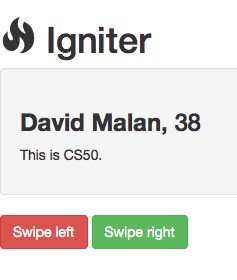

# CS50 Section. Week 10. 11/10/15.
_Tuesdays 7:00-8:30pm, Science Center 309A. [https://github.com/hathix/cs50-section](https://github.com/hathix/cs50-section)._

Neel Mehta. neelmehta@college.harvard.edu. (215) 990-6434.

Get these handouts at [https://github.com/hathix/cs50-section/tree/master/handouts](https://github.com/hathix/cs50-section/tree/master/handouts).

# JavaScript
## Functions

```js
// "function declaration" syntax
function add(a, b) {
    return a + b;
}

// "function literal" syntax
var subtract = function(a, b) {
    return a - b;
};
```

**Functions are variables!**

```js
function call(myFunction, x, y) {
    return myFunction(x, y);
}

// prints 7
console.log(call(subtract, 9, 2));

// prints 12
console.log(call(function(a, b){
    return a * b;
}, 3, 4));
```

## Callbacks
Functions that you pass to other functions are called _callbacks_.

```js
function callback(){
    console.log("Hi!");
};
waitForABitThenRun(callback);
```

## Arrays

```js
// mixed types in arrays
var numbers = [1, 2, 3];
var stuff = ["Cherry", 43.5, ["a", "b", "c"]];

// prints 1, 2, 3
for (var i = 0; i < numbers.length; i++) {
    console.log(numbers[i]);
}

// prints [1, 2, 3, 4]
numbers.push(4);
console.log(numbers);
```

## Objects

```js

var movie = {
    title: "Moneyball",
    year: 2011,
    tags: ["baseball", "oakland"],
    synopsis: function() {
        // `this` gives access to the object's other fields
        console.log(this.title + ": " + this.year);
    }
};

// prints 2011
console.log(movie.year);

// prints "Harry Potter"
movie.title = "Harry Potter";
console.log(movie.title);

// prints "Harry Potter: 2011"
console.log(movie.synopsis());
```

## Ajax

```js
var arguments = {
    key: "value"
};
$.getJSON("api-endpoint.php", arguments)
.done(function(data, textStatus, jqXHR) {
    // success!
    // data is a JavaScript object; ignore the other 2 variables
    console.log(data);
})
.fail(function(jqXHR, textStatus, errorThrown) {
    // failure!
    // errorThrown provides error info; ignore the other 2 variables
    console.log(errorThrown.toString());
});
```

## Templating

```js
var templateFunction = _.template("<a href='<%- url %>' class='btn btn-<%- btnClass %>'><%- text %></a>");
var htmlString = templateFunction({
    url: "http://yale.edu",
    btnClass: "danger",
    text: "Safety school"
});
```

# Challenge: Weather
We're going to make a simple weather app!


Give it a shot: [http://is.gd/cs50_weather](http://is.gd/cs50_weather)

Solution: [https://github.com/hathix/cs50-section/blob/master/code/10/weather-soln.js](https://github.com/hathix/cs50-section/blob/master/code/10/weather-soln.js)

# Challenge: Ignite
We're going to make a dating app where you can see people's bios and "swipe left" or "swipe right" on them. We're gonna be millionaires!



Give it a shot: [http://is.gd/cs50_ignite](http://is.gd/cs50_ignite)

Solution: [https://github.com/hathix/cs50-section/blob/master/code/10/igniter-soln.js](https://github.com/hathix/cs50-section/blob/master/code/10/igniter-soln.js)
