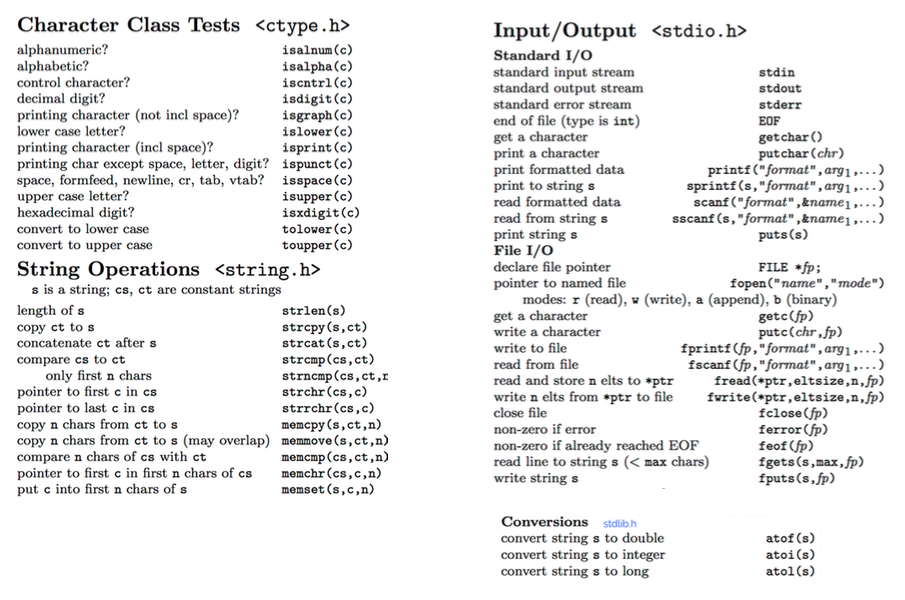

# CS50 Section. Week 11. Quiz 1 Review. Last section :(. 11/10/15.
_Tuesdays 7:00-8:30pm, Science Center 309A. [https://github.com/hathix/cs50-section](https://github.com/hathix/cs50-section)._

Neel Mehta. neelmehta@college.harvard.edu. (215) 990-6434.

Get these handouts at [https://github.com/hathix/cs50-section/tree/master/handouts](https://github.com/hathix/cs50-section/tree/master/handouts).

# Quiz 1
_Wed 11/18, 1-2p_. Quiz info: [http://cdn.cs50.net/2015/fall/quizzes/1/harvard.html](http://cdn.cs50.net/2015/fall/quizzes/1/harvard.html)

# Topics covered
- Week 6. TCP/IP. HTTP.
- Week 7. HTML. CSS. PHP.
- Week 8. MVC. SQL.
- Week 9. JavaScript. Ajax.
- Week 10. Security. Artificial intelligence.

Stuff to keep in mind:
- Huffman coding might pop up on the exam: [https://study.cs50.net/huffman](https://study.cs50.net/huffman)
- Looks like you should review the AI guest lectures.
- Security will likely be on the exam.

# Resources
- My section handouts (I recommend doing some of the practice problems again): [https://github.com/hathix/cs50-section/tree/master/handouts](https://github.com/hathix/cs50-section/tree/master/handouts)
- Review session slides: [http://cdn.cs50.net/2015/fall/quizzes/1/review1.pdf](http://cdn.cs50.net/2015/fall/quizzes/1/review1.pdf)
- Video about MVC: [https://www.youtube.com/watch?v=vqcQD-HmLl8](https://www.youtube.com/watch?v=vqcQD-HmLl8)

# Stuff for your cheat sheet
## Algorithms

Name           | What it does                                               | Worst-case | Best-case
-------------- | ---------------------------------------------------------- | ---------- | ----------
Linear search  | Finds an element in a list by searching left-to-right      | O(n)       | Ω(1)
Binary search  | Finds an element in a sorted list using divide-and-conquer | O(log n)   | Ω(1)
Bubble sort    | Sorts a list by bubbling biggest elements to end           | O(n^2)     | Ω(n)
Selection sort | Sorts a list by moving smallest elements to front          | O(n^2)     | Ω(n^2)
Insertion sort | Sorts a list by moving elements to properly sorted place   | O(n^2)     | Ω(n)
Merge sort     | Recursively sorts a list by partitioning and merging       | O(n log n) | Ω(n log n)

More at [http://www.bigocheatsheet.com/](http://www.bigocheatsheet.com/).

## Data types
The below are for a 64-bit machine (so named because pointers are 64 bits) like the CS50 IDE.

**Type**         | char | int | float | double | long long | int*
---------------- | ---- | --- | ----- | ------ | --------- | ----
**Size (bytes)** | 1    | 4   | 4     | 8      | 8         | 8

- Unsigned types are the same size as the normal types (e.g. `unsigned int`, like `int`, is 4 bytes)
- All pointers are the same size (e.g. `double*`, like `int*`, is 8 bytes)

## Useful functions

## Common errors

Error                                                  | Why it happened
------------------------------------------------------ | -------------------------------------------------------------------------------------------
undefined reference to 'function'                      | You forgot to call the linker with, e.g., `-lcs50`
implicitly declaring library function                  | You forgot to `#include` the `.h` file
implicit declaration of function 'function' is invalid | You forgot to `#include` the `.h` file
more '%' conversions than data arguments               | You called, e.g., `printf("%i and %i \n", 5)` (you passed 1 number but should have given 2)
definitely lost: # bytes in # blocks                   | You forgot to `free` memory you allocated with `malloc`
invalid write of size #                                | You tried changing a value beyond the end of an array
use of undeclared identifier                           | You forgot to declare the variable, or it's out of scope

## HTTP status codes

Code | HTTP Status                | Description/Cause
---- | -------------------------- | -----------------------------------------------------------------------
200  | OK                         | Server successfully handled and responded to request
302  | Found                      | Redirects client to another URL
400  | Bad Request                | Malformed query
403  | Forbidden                  | File exists, but cannot be accessed (permissions problem)
404  | Not Found                  | File doesn't exist
405  | Method Not Allowed         | Server can't handle that method (GET, POST, etc.)
413  | Request Entity Too Large   | Entire request string longer than server can handle
414  | Request-URI Too Long       | Too much data in GET
500  | Internal Server Error      | Server's fault: MySQL failed, error parsing PHP, bad config files, etc.
501  | Not Implemented            | Server doesn't know how to handle that mimetype                         |
505  | HTTP Version Not Supported | Request used wrong HTTP version (HTTP/1.1 needed)
