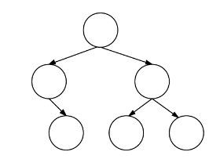

# CS50 Section. Week 11. Quiz 1 Review. Last section :(. 11/10/15.
_Tuesdays 7:00-8:30pm, Science Center 309A. [https://github.com/hathix/cs50-section](https://github.com/hathix/cs50-section)._

Neel Mehta. neelmehta@college.harvard.edu. (215) 990-6434.

Get these handouts at [https://github.com/hathix/cs50-section/tree/master/handouts](https://github.com/hathix/cs50-section/tree/master/handouts).

# Quiz 1
_Wed 11/18, 1-2p_. Quiz info: [http://cdn.cs50.net/2015/fall/quizzes/1/harvard.html](http://cdn.cs50.net/2015/fall/quizzes/1/harvard.html)

# Topics covered
- Week 6. TCP/IP. HTTP.
- Week 7. HTML. CSS. PHP.
- Week 8. MVC. SQL.
- Week 9. JavaScript. Ajax.
- Week 10. Security. Artificial intelligence.

Stuff to keep in mind:
- Huffman coding might pop up on the exam: [https://study.cs50.net/huffman](https://study.cs50.net/huffman)
- Looks like you should review the AI guest lectures.
- Security will likely be on the exam.

# Resources
- My section handouts (I recommend doing some of the practice problems again): [https://github.com/hathix/cs50-section/tree/master/handouts](https://github.com/hathix/cs50-section/tree/master/handouts)
- Review session slides: [http://cdn.cs50.net/2015/fall/quizzes/1/review1.pdf](http://cdn.cs50.net/2015/fall/quizzes/1/review1.pdf)
- Video about MVC: [https://www.youtube.com/watch?v=vqcQD-HmLl8](https://www.youtube.com/watch?v=vqcQD-HmLl8)

# Challenges
## Form validation (2014 fall #15-16)
Consider the HTML below.

```html
<!DOCTYPE html>
<html>

<head>
  <script src="http://code.jquery.com/jquery-latest.min.js"></script>
  <script src="/scripts.js"></script>
  <title>Frosh IMs</title>
</head>

<body>
  <form action="/register.php" id="registration" method="get">
    <input id="name" name="name" placeholder="Name" type="text" />
    <br />
    <select id="dorm" name="dorm" size="1">
      <option value="">
        Dorm
      </option>
      <option value="Matthews Hall">Matthews Hall</option>
      <option value="Other">Other</option>
    </select>
    <br/>
    <input type="submit" value="Register" />
  </form>
</body>

</html>
```

### Request line
Suppose that David from Matthews Hall submits this form. Complete the request line below of the HTTP request that the form's submission will generate.

```
GET
```

### jQuery
Complete the implementation of `scripts.js` below in such a way that it prevents the form's submission if a user fails to input a name or select a dorm.

```js
$(function(){


});
```

## Binary search trees (2013 fall #32-34)
Recall that a binary search tree (BST) is a binary tree (each of whose nodes has 0, 1, or 2 children), the value of whose root is: greater than its left child, if any, and any descendants theref; and less than that of its right child, if any, and any descendants thereof. Moreover, each child is the root of a BST.

### BST
Consider the binary search tree whose nodes do not yet have values.



Insert the six integers below into that tree, as by writing one integer in each circle, in such a way that the tree is a BST.

> 34, 59, 20, 106, 36, 52

### Node
Complete the definition of `node` below in such a way that it represents a node in a BST, the value of which is of type `int`. You may name its fields however you'd like.

```c
typedef struct node {


}
node;
```

### Traverse
## SQL
# Stuff for your cheat sheet
## Algorithms

Name           | What it does                                               | Worst-case | Best-case
-------------- | ---------------------------------------------------------- | ---------- | ----------
Linear search  | Finds an element in a list by searching left-to-right      | O(n)       | Ω(1)
Binary search  | Finds an element in a sorted list using divide-and-conquer | O(log n)   | Ω(1)
Bubble sort    | Sorts a list by bubbling biggest elements to end           | O(n^2)     | Ω(n)
Selection sort | Sorts a list by moving smallest elements to front          | O(n^2)     | Ω(n^2)
Insertion sort | Sorts a list by moving elements to properly sorted place   | O(n^2)     | Ω(n)
Merge sort     | Recursively sorts a list by partitioning and merging       | O(n log n) | Ω(n log n)

More at [http://www.bigocheatsheet.com/](http://www.bigocheatsheet.com/).

## Data structures

Operation                                      | Worst-case | Best-case
---------------------------------------------- | ---------- | ---------
Insertion into hash table w/ separate chaining | O(1)       | Ω(1)
Search through hash table with `k` buckets     | O(n/k)     | Ω(1)
Insertion into trie                            | O(1)       | Ω(1)
Insertion into unsorted linked list            | O(1)       | Ω(1)
Insertion into sorted linked list              | O(n)       | Ω(1)
Search through linked list (sorted or not)     | O(n)       | Ω(1)
Deletion from linked list (sorted or not)      | O(n)       | Ω(1)

## Data types
The below are for a 64-bit machine (so named because pointers are 64 bits) like the CS50 IDE.

**Type**         | char | int | float | double | long long | int*
---------------- | ---- | --- | ----- | ------ | --------- | ----
**Size (bytes)** | 1    | 4   | 4     | 8      | 8         | 8

- Unsigned types are the same size as the normal types (e.g. `unsigned int`, like `int`, is 4 bytes)
- All pointers are the same size (e.g. `double*`, like `int*`, is 8 bytes)
- A `struct`'s size is the sum of the sizes of its components.

## Common errors

Error                                                  | Why it happened
------------------------------------------------------ | -------------------------------------------------------------------------------------------
undefined reference to 'function'                      | You forgot to call the linker with, e.g., `-lcs50`
implicitly declaring library function                  | You forgot to `#include` the `.h` file
implicit declaration of function 'function' is invalid | You forgot to `#include` the `.h` file
more '%' conversions than data arguments               | You called, e.g., `printf("%i and %i \n", 5)` (you passed 1 number but should have given 2)
definitely lost: # bytes in # blocks                   | You forgot to `free` memory you allocated with `malloc`
invalid write of size #                                | You tried changing a value beyond the end of an array
use of undeclared identifier                           | You forgot to declare the variable, or it's out of scope

## File permissions
To successfully `GET` a file, the file must be world-readable, and all of its ancestor directories must be world-executable.

**Recommended permissions:**

File/directory type    | Permission | Representation
---------------------- | ---------- | --------------
Public directories     | 711        | `drwx--x--x`
Non-public directories | 700        | `drwx------`
PHP files              | 600        | `-rw-------`
Non-PHP files          | 644        | `-rw-r--r--`

## HTTP status codes

Code | HTTP Status                | Description/Cause
---- | -------------------------- | -----------------------------------------------------------------------
200  | OK                         | Server successfully handled and responded to request
302  | Found                      | Redirects client to another URL
400  | Bad Request                | Malformed query
403  | Forbidden                  | File exists, but cannot be accessed (permissions problem)
404  | Not Found                  | File doesn't exist
405  | Method Not Allowed         | Server can't handle that method (GET, POST, etc.)
413  | Request Entity Too Large   | Entire request string longer than server can handle
414  | Request-URI Too Long       | Too much data in GET
500  | Internal Server Error      | Server's fault: MySQL failed, error parsing PHP, bad config files, etc.
501  | Not Implemented            | Server doesn't know how to handle that mimetype                         |
505  | HTTP Version Not Supported | Request used wrong HTTP version (HTTP/1.1 needed)

## SQL

```sql
# select: get rows
SELECT name FROM movies
SELECT * FROM movies WHERE year = 2008 AND stars = 4
SELECT name, stars FROM movies WHERE id = 5

# insert: add rows
INSERT INTO movies (name, year, stars) VALUES ("Finding Nemo", 2003, 5)

# update: change rows
UPDATE movies SET stars = 3 WHERE id = 9
UPDATE movies SET stars = stars + 1 WHERE id = 3

# delete: remove rows
DELETE FROM movies WHERE stars = 0
```

## jQuery

```js
// click handlers
$("#my-button").click(function(){
    // do something
});

// changing html
$("#my-element").html("<strong>Cool new HTML</strong>");

// getting values from input fields
var input = $("#my-text-input").val();

// form validation
$("#my-form").submit(function(){
    if (/* something wrong in form */) {
        return false;
    }
    return true;
});
```
