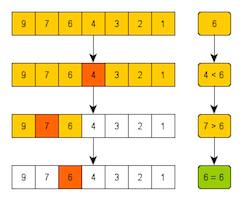
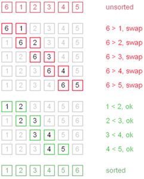
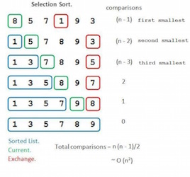
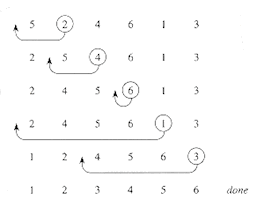
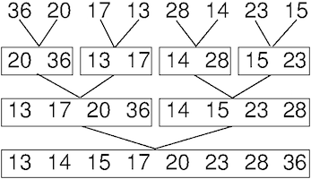

# CS50 Section. Week 4. 9/28/15.
*Tuesdays 7:00-8:30pm, Science Center 309A*

> Neel Mehta  
> neelmehta@college.harvard.edu  
> (215) 990-6434

Grab this handout at <http://is.gd/neel_cs50_4>.

# Important links

* These handouts and practice problems: <https://github.com/hathix/cs50-section/>
* Sorting algorithm visualizations: <http://www.sorting-algorithms.com/>
* C language reference: https://reference.cs50.net/
* CS50 Study: https://study.cs50.net/
* CS50 Discuss: https://cs50.harvard.edu/discuss
* CS50 Style Guide: https://manual.cs50.net/style/

# pset3 tips

## Sort

* Try implementing all 3 sorting algorithms we discussed (bubble, insertion, selection.)
* You can test your sorting function in the same way you tested search (i.e. using `./generate` and `./find`.) But also test some edge cases like entering zero or one haystack elements.   

## Game of Fifteen

* Implement functions in order of `init`, `draw`, `move`, `won`. You can start testing the game a little once you're done `draw`, and more fully once you're done `move`.
* To print out a number with padding, try

```c
// if x == 7, this prints " 7"
// if x == 12, this prints "12"
// (the number before i indicates how many spaces to pad to)
printf("%2i", x);
```

## General pset tips

**Make sure your pset passes `style50` and `check50` (i.e. doesn't generate any frowny faces.) You can't get full credit on correctness and style unless your code passes these!**

# Suggestions from last pset

## Use descriptive variable names!

It's important to give your variables descriptive names so your code is easy to read and understand. Here are some variable names you could have used in greedy.c:

Bad name | OK name | Good name
---------|---------|----------
q | -- | quarters
p | -- | pennies
c | amount | change
c | count | coins

Two big things to remember:

* Don't use single-letter variables except `i`, `j`, and `k` in loops. Single letters aren't descriptive at all.
* Abstract names like "count" are OK, but concrete names like "coins" are better -- they make it clear what you're dealing with.

Quick! What is this code calculating?

```c
int c = 30;
int sp = 1500;
int pp = 1200;
int r = sp * c;
int p = r - pp * c;
```

How about this code?

```c
int cars_sold = 30;
int car_sales_price = 1500;
int car_production_price = 1200;
int revenue = car_sales_price * cars_sold;
int profit = revenue - car_production_price * cars_sold;
```

## Comments: explain why, not what

It's good to have a lot of comments, but make sure your comments are explaining *why* your code is doing what it's doing, not just *what* it's doing.

The comments in the below snippet aren't very good, because they just repeat what the code is doing, and that much is obvious just from reading the code:

```c
string original = "Cambridge";
// find the string length
int length = strlen(original);
// make a new array that's the same size as the original (with 1 more spot)
char reversed[length + 1];

// go through every letter in the original string
for (int i = 0; i < length; i++)
{
    // put a character from the original string in the reversed string
    reversed[length - i - 1] = original[i];
}

// put a null character at the end of the reversed string
reversed[length] = '\0';
```

The comments in the below snippet are much better, because they explain your high-level strategy nd make your logic clearer.

```c
// reverse the string `original` into the string `reversed`
// e.g. "Cambridge" becomes "egdirbmaC"
string original = "Cambridge";
int length = strlen(original);
// we need the extra slot for the null terminator
char reversed[length + 1];

for (int i = 0; i < length; i++)
{
    // fill in the reversed string back-to-front
    // while moving front-to-back in original string
    reversed[length - i - 1] = original[i];
}

reversed[length] = '\0';
```

# Notes

## Function prototypes

Say you want to use a function besides `main`. It's not enough to just write the function; C reads top-to-bottom so you'll need to tell C some information about the function ahead of time.

```c
#include <stdio.h>

// function prototype
// <return type> <name>(<argument type>, ...)
// this is the same as in the function definition, except you don't
// specify the argument names
float months_to_years(int);

int main(void)
{
    // prints 1.50
    // (the "%.2f" means to print a float with 2 decimal places)
    printf("%.2f\n", months_to_years(18));
}

// function definition
// <return type> <name>(<argument type> <argument name>, ...)
// here's where you *actually* implement the function
float months_to_years(int months)
{
    return years / 12.0;
}
```

By the way, if you were actually writing this code, you wouldn't include any of these comments. They're just for illustration here.

## 2D arrays

These are really important for the Game of Fifteen. 2D arrays behave kinda like the coordinate grid except that:

* The origin ([0][0]) is in the top left
* You count down, then right.

[0][0] | [0][1] | [0][2]
-------|--------|-------
[1][0] | [1][1] | [1][2]
[2][0] | [2][1] | [2][2]


How you might work with a 2D array:

```c
// creates a 2D array with 3 rows and 4 columns
int width = 4;
int height = 3;
int grid[height][width];

// this will fill the grid like such:
//  0   1   2   3
// 10  11  12  13
// 20  21  22  23
for (int i = 0; i < height; i++)
{
    for (int j = 0; j < width; j++)
    {
        grid[i][j] = 10 * i + j;
    }
}

// prints 0
printf("%i\n", grid[0][0]);
// prints 23
printf("%i\n", grid[height - 1][width - 1]);
```

## Binary search

Binary search finds a value in a *sorted* array. You cut the problem in half at each stage by eliminating the half of the array that couldn't possibly contain the element you're looking for.



```
while there are still elements to search:
    find middle element
    if middle element = what we're looking for:
        return true
    if middle element < what we're looking for:
        look in lower half
    if middle element > what we're looking for:
        look in upper half

return false (give up)
```

## Bubble sort

In a sorted array, every element will be smaller than the one to its right, so this sort swaps two neighboring elements if they're out of order. This way, the biggest elements end up *bubbling* to the top.



```
for each element X in the array:
    for each remaining element Y in array:
        swap X and Y if X > Y
```

## Selection sort

This sort *selects* the smallest elements remaining in the array and swaps them so they're in the front.



```
for each element in the array:
    find the smallest element in the rest of the array
    swap that element with the current element
```

## Insertion sort

This sort sorts the array as it sees it, *inserting* each element in its proper place in the array.



```
for each element in the array:
    look at the element X directly to our right
    shift all elements on our left to the right if they're > X
    put X in the vacated spot
```

## Merge sort

This sort recursively sorts its sub-arrays and then *merges* them together to produce one larger sorted sub-array.



```
function sort:
    sort left half
    sort right half
    merge two halves

function merge:
    create temporary array
    while elements in left & right sub-arrays:
        compare first elements of two sub-arrays; place smaller one
            in temp array
    dump any remaining elements in longer sub-array in temp array
    copy temp array onto original array
```

## Algorithm cheatsheet

Name | What it does | Worst-case | Best-case
-----|--------------|------------|----------
Linear search | Finds an element in a list by searching left-to-right | O(n) | Ω(1)
Binary search | Finds an element in a sorted list using divide-and-conquer | O(log n) | Ω(1)
Bubble sort | Sorts a list by bubbling biggest elements to end | O(n^2) | Ω(n)
Selection sort | Sorts a list by moving smallest elements to front | O(n^2) | Ω(n^2)
Insertion sort | Sorts a list by moving elements to properly sorted place | O(n^2) | Ω(n)
Merge sort | Recursively sorts a list by partitioning and merging | O(n log n) | Ω(n log n)

More at <http://www.bigocheatsheet.com/>.

# Challenges

Solutions at <https://github.com/hathix/cs50-section/blob/master/code/4>.

## Binary search

```c
bool search(int value, int values[], int n)
{


}
```

## Bubble sort

```c
void bubble_sort(int array[], int n)
{


}
```

## Selection sort

```c
void selection_sort(int array[], int n)
{


}
```

## Insertion sort

```c
void insertion_sort(int array[], int n)
{


}
```

##  Merge sort

Try it on your own at <https://github.com/hathix/cs50-section/blob/master/code/4/sort-challenge.c>!
