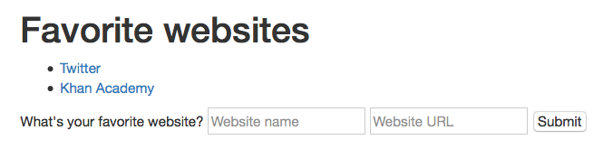

# CS50 Section. Week 7. 10/20/15.
_Tuesdays 7:00-8:30pm, Science Center 309A. [https://github.com/hathix/cs50-section](https://github.com/hathix/cs50-section)._

Neel Mehta. neelmehta@college.harvard.edu. (215) 990-6434.

Get these handouts at [https://github.com/hathix/cs50-section/tree/master/handouts](https://github.com/hathix/cs50-section/tree/master/handouts).

# Final projects
## Pre-proposal
> Intended to promote early thought, the pre-proposal is your opportunity to bounce one or more ideas off of your teaching fellow. Quite simply, by this pre-proposal's deadline, send an email to your teaching fellow, CCing projects@cs50.harvard.edu, **describing one or more ideas that you have for your final project**. Short, casual emails are fine, but do explain the motivation behind each of your ideas (i.e., **why it interests you**). Treat this requirement as an **opportunity for counsel**. Certainly include any questions or concerns that you have in this email. The subject line of your email should be Pre-Proposal

Due by email to me on Mon. 11/2!

## Tips
- **Make a project for a club!** Examples:
  - Website for cultural group
  - App for CS club project
  - Website for house/dorm spirit

- Try using web technologies like:
  - jQuery: [http://jquery.com](http://jquery.com)
  - React: [https://facebook.github.io/react](https://facebook.github.io/react)
  - Bootstrap: [http://getbootstrap.com](http://getbootstrap.com)

- Attend CS50 Seminars to learn cool new technologies for your project: [https://manual.cs50.net/seminars/](https://manual.cs50.net/seminars/)
- Find a team of 2-3! Ask friends, fellow sectioneers, people in your clubs, etc.

# HTML
Try out your own HTML or follow along at [http://is.gd/cs50_html](http://is.gd/cs50_html)!

## Sample code

```html
<!-- basic elements -->
<h1>This is CS50.</h1>

<p>But, unfortunately, this is just a run-of-the-mill paragraph.</p>

<button>Self destruct</button>

<!-- nested elements -->
<p>
  Feeling lucky? If so <button>click me</button>.  
</p>

<!-- attributes -->
<input type="text" placeholder="Type something...">
<button>Search</button>

<!-- ul and multi-nested elements -->
<p>Some cities:</p>
<ul>
  <li>Boston</li>
  <li>Cambridge</li>
  <li>Somerville</li>
</ul>

<!-- links -->
<p><a href="http://yale.edu">Safety school</a></p>

<!-- tables -->
<table>
    <tr>
        <th>House</th>
        <th>Rating (of 5)</th>
        <th>Comments</th>
    </tr>
    <tr>
        <th>Pforzheimer</th>
        <th>5.0</th>
        <th>That spelling is pfantastic.</th>
    </tr>
    <tr>
        <th>Adams</th>
        <th>3.4</th>
        <th>Walls painted <em>gold</em>? That's a bit much.</th>
    </tr>
</table>
```

## Form challenge
Write HTML to generate a page like this:



Solution: [https://github.com/hathix/cs50-section/blob/master/code/8/html-soln.html](https://github.com/hathix/cs50-section/blob/master/code/8/html-soln.html)

# PHP
You can test out PHP code at [http://phpfiddle.org/](http://phpfiddle.org/)!

## Associative arrays
Associative arrays are simple hash tables, or arrays with strings as keys and not integers.

```php
<?php
    $movie = ["name" => "Up", "rating" => 5, "comment" => "Needs more squirrels"];

    // prints "Up!!!" (without quotes)
    $name = $movie['name'] . "!!!";
    printf($name);

    // prints "6" (quotes)
    $movie['rating']++;
    printf($movie['rating']);
?>
```

## Of `GET`s and `POST`s
The "superglobals" `$_GET` and `$_POST` contain data from the URL string and from forms, respectively.

```php
<?php
    // if user reached page via GET (as by clicking a link or via redirect)
    if ($_SERVER["REQUEST_METHOD"] == "GET")
    {
        $query = $_GET["query"];
        printf("You searched for $query.");
    }
    // else if user reached page via POST (as by submitting a form via POST)
    else if ($_SERVER["REQUEST_METHOD"] == "POST")
    {
        $username = $_POST["username"];
        printf("Yo, $username!");
    }

?>
```

## HTML templating
PHP has weird syntax for conditional templating.

```php
<div>
    <?php if (is_logged_in()): ?>
        <p>Welcome to Facebook!</p>
    <?php else: ?>
        <a href="/login.php">Log in, dude!</a>
    <?php endif; ?>
</div>
```

You can use `<?= $variable; ?>` to print out variables.

```php
<?php
    $username = "Neel";
    $teams = ["Phillies", "Red Sox", "Orioles"];
?>

<p>Some of <?= $username ?>'s favorite teams:</p>
<ul>
    <?php foreach ($teams as $team): ?>
        <li>
            Go <?= $team ?>!
        </li>
    <?php endforeach; ?>
</ul>
```

## Challenge
You already have this PHP code:

```php
<?php
    $drinks = [
        ["name" => "Coke", "price" => 3],
        ["name" => "Sprite", "price" => 4],
        ["name" => "Water", "price" => 11]
    ];
?>
```

Write more PHP/HTML code that uses `$drinks` and `foreach` to generate a table like this:

Name   | Price
------ | -----
Coke   | 3
Sprite | 4
Water  | 11

Solution: [https://github.com/hathix/cs50-section/blob/master/code/8/php-soln.php](https://github.com/hathix/cs50-section/blob/master/code/8/php-soln.php)
